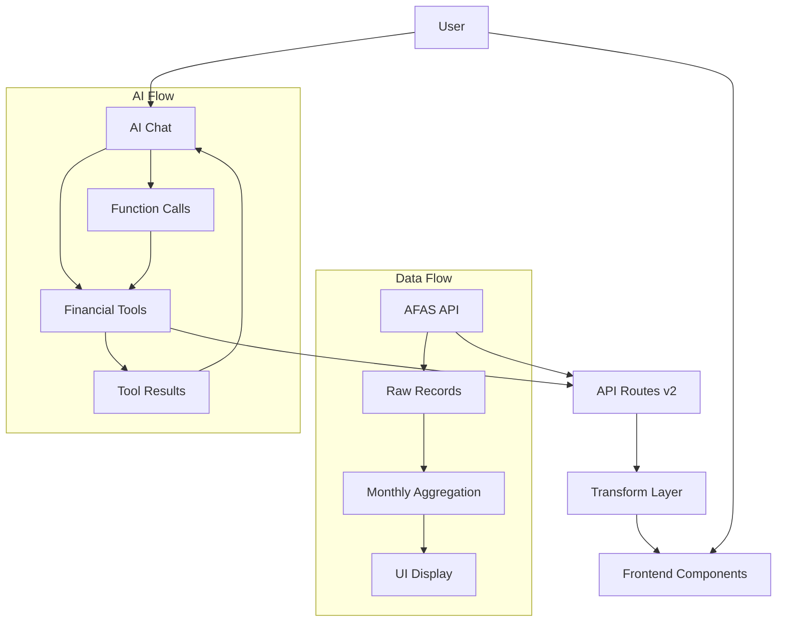
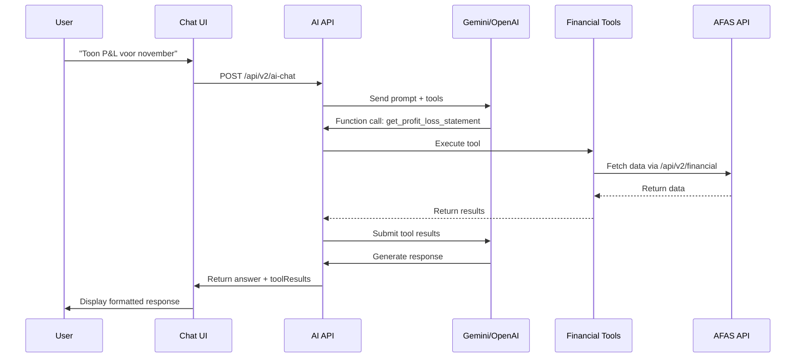

# Financial Controller Agent - Volledig Project Overzicht

## 📋 Project Samenvatting

De **Financial Controller Agent** is een Next.js 15 webapplicatie die financiële data van AFAS integreert met AI-gestuurde analyse mogelijkheden. Het project biedt zowel traditionele dashboards als geavanceerde AI chat functionaliteit voor financiële rapportage en analyse.

### Technische Stack
- **Framework**: Next.js 15.3.5 met App Router
- **Frontend**: React 19, TailwindCSS 4
- **Backend**: Node.js API routes
- **AI**: OpenAI GPT-5 + Google Gemini 2.5 Flash
- **Data Source**: AFAS REST API (Profit)
- **Deployment**: Vercel ready

---

## 🏗️ Architectuur Overzicht



---

## 📁 Project Structuur

### App Directory (`app/`)
```
app/
├── api/v1/               # Legacy API routes
│   ├── local/           # Local test data
│   └── test/            # Test endpoints
├── api/v2/              # Hoofdfunctionaliteit
│   ├── ai-chat/         # AI Chat endpoint (Gemini 2.5)
│   ├── chat/            # OpenAI GPT-5 endpoint
│   ├── chat-gemini/     # Legacy Gemini endpoint
│   └── financial/       # AFAS data endpoints
│       ├── all/         # Bulk data ophalen
│       └── route.js     # Hoofd financial API
├── demo/                # Demo interfaces
│   ├── v1/              # Basis versie
│   └── v2/              # Geavanceerde versie
│       ├── AIChat.jsx   # AI Chat component
│       ├── ChatFinanceGemini.jsx # Legacy chat
│       └── page.js      # Hoofd dashboard
├── layout.js            # Root layout
└── page.js              # Landing page
```

### Library (`lib/`)
```
lib/
└── finance/
    ├── tools.js         # AI financial functions (17 tools)
    └── transform.js     # Data transformatie logica
```

### Components (`components/`)
```
components/
└── v1/
    └── MonthlyChecks.js # Legacy maandelijkse controles
```

### Documentation (`docs/`)
```
docs/
├── afas_mapping.md           # AFAS data mapping
├── ai_chat_implementation.md # AI implementatie details
├── ai_tools.md              # Tool documentatie
├── financial_functions_guide.md # Complete functies gids
└── gemini_chat_integration.md   # Gemini integratie
```

---

## 🔄 Data Flow Architectuur

### 1. AFAS Data Ophalen

**Endpoint**: `/api/v2/financial/all`
- Haalt **alle** financiële mutaties op van AFAS
- Gebruikt paginering (20.000 records per pagina)
- Bevat safety stop bij 1M records
- **Authentication**: AFAS Token in Authorization header

**AFAS URL**:
```
https://96778.resttest.afas.online/ProfitRestServices/connectors/Innoworks_Financiele_mutaties
```

**Belangrijke Velden**:
- `Jaar` / `Periode` - Datum informatie
- `Type_rekening` - Hoofdcategorie (Activa, Passiva, Kosten, Opbrengsten)
- `Omschrijving_3` - Primaire categorisering
- `Kenmerk_rekening` - Backup categorisering
- `Bedrag_debet` / `Bedrag_credit` - Bedragen
- `Boekstuknummer` - Audit trail
- `Rekeningnummer` - Grootboekrekening
- `Kostenplaats` / `Project` - Dimensies

### 2. Data Transformatie

**File**: `lib/finance/transform.js`

**Hoofdfuncties**:
- `buildFinancialView()` - Hoofdtransformatie functie
- `getCategoryFromDescription()` - Categorie mapping
- `getAccountTypeName()` - Type mapping

**Transformatie Proces**:
1. **Raw Data Preparation**: Toevoegen van afgeleide velden
2. **Period Filtering**: Filteren op datum range
3. **Monthly Aggregation**: Groeperen per maand
4. **Category Breakdown**: Totalen per categorie
5. **Account Type Breakdown**: Totalen per account type

**Output Structuur**:
```javascript
{
  monthlyData: [
    {
      year: 2024,
      month: 11,
      monthName: "november 2024",
      records: [...],
      totalDebet: 150000,
      totalCredit: 125000,
      netAmount: -25000,
      categorieBreakdown: {
        "Netto-omzet": { netAmount: 125000, recordCount: 15 },
        "Autokosten": { netAmount: -15000, recordCount: 8 }
      },
      accountTypeBreakdown: {
        "Opbrengsten": { netAmount: 125000 },
        "Kosten": { netAmount: -25000 }
      }
    }
  ],
  categoryTotals: {...},
  accountTypeTotals: {...},
  allRecords: [...]
}
```

### 3. Frontend Data Verwerking

**Main Component**: `app/demo/v2/page.js` (3583 regels)

**Key Features**:
- **Period Selection**: Jaar/maand selectie met quick select opties
- **Data Loading**: Progressive loading met progress indicator
- **Tab Interface**: Summary, Transactions, W&V, Balans, Kasstroom, AI Chat
- **Drill-down**: Klikbare bedragen voor detail views
- **Export**: Excel export functionaliteit

**State Management**:
```javascript
const [data, setData] = useState(null);           // Transformed data
const [allRecords, setAllRecords] = useState(null); // Raw AFAS records
const [selectedCategory, setSelectedCategory] = useState(null); // Drill-down
const [activeTab, setActiveTab] = useState('summary'); // UI state
```

---

## 🤖 AI Chat Implementatie

### Overzicht
Het project ondersteunt **twee AI providers**:
1. **Gemini 2.5 Flash** (primair) - `/api/v2/ai-chat`
2. **OpenAI GPT-5** - `/api/v2/chat`

### Financial Tools (`lib/finance/tools.js`)

**17 Beschikbare Functies**:

#### 1. Basis Rapportages
- `get_profit_loss_statement` - W&V genereren
- `get_balance_sheet` - Balans genereren  
- `get_cash_flow_statement` - Kasstroom genereren

#### 2. Data Analyses
- `list_journal_entries` - Grootboekboekingen opvragen
- `aggregate_by` - Aggregatie per dimensie
- `variance_report` - Periodevergelijking
- `top_deviations` - Grootste afwijkingen
- `explain_account_change` - Mutatie analyse
- `anomaly_scan` - Anomalie detectie
- `reconcile_pl_to_balance` - P&L/Balans aansluiting

#### 3. Ratio's & KPIs
- `ratio_current` - Current ratio
- `ratio_quick` - Quick ratio
- `ratio_debt_to_equity` - Solvabiliteit
- `ratio_gross_margin` - Bruto marge
- `trend` - Trendanalyse

#### 4. Specifieke Rapportages
- `aging_report` - Debiteuren/crediteuren ouderdom
- `journal_template` - Boekingssjablonen

### AI Chat Flow



### Tool Implementation Details

**Function Call Format**:
```javascript
{
  name: 'get_profit_loss_statement',
  description: 'Genereren van een winst- en verliesrekening',
  parameters: {
    type: Type.OBJECT,
    properties: {
      period_from: { type: Type.STRING, description: 'Begin periode (YYYY-MM)' },
      period_to: { type: Type.STRING, description: 'Eind periode (YYYY-MM)' },
      granularity: { type: Type.STRING, description: 'Detailniveau (month/quarter/YTD)' }
    },
    required: ['period_from', 'period_to']
  }
}
```

**Audit Trail**:
Elke functie retourneert:
- `source_refs` - Array van boekstuknummers
- `query_hash` - SHA256 hash voor audit
- `rows` - Data resultaten
- `totals` - Samenvattingen

---

## 📊 API Endpoints

### Financiële Data

#### `/api/v2/financial` (GET)
**Doel**: Hoofd endpoint voor financiële data
**Parameters**:
- `startYear`, `startMonth` - Begin periode
- `endYear`, `endMonth` - Eind periode

**Response**:
```javascript
{
  source: "AFAS API v2",
  range: { startYear: 2024, startMonth: 1, endYear: 2024, endMonth: 11 },
  monthlyData: [...],
  categoryTotals: {...},
  accountTypeTotals: {...},
  allRecords: [...],
  performanceChecks: [...] // 15 financial checks
}
```

#### `/api/v2/financial/all` (GET)
**Doel**: Bulk data ophalen voor client-side processing
**Parameters**:
- `singlePage=1` - Paginering mode
- `skip`, `take` - Pagination

**Response**:
```javascript
{
  source: "AFAS API v2 - all",
  totalRecords: 150000,
  fetchedAll: true,
  pagesFetched: 8,
  allRecords: [...]
}
```

### AI Chat Endpoints

#### `/api/v2/ai-chat` (POST)
**Provider**: Google Gemini 2.5 Flash
**Input**:
```javascript
{
  messages: [
    { role: 'user', content: 'Toon P&L voor november' }
  ],
  period_from: '2024-01',
  period_to: '2024-11',
  baseUrl: 'http://localhost:3000'
}
```

**Output**:
```javascript
{
  answer: "Hier is de P&L voor november...",
  toolResults: {
    "tool_call_123": { /* tool result data */ }
  }
}
```

#### `/api/v2/chat` (POST)
**Provider**: OpenAI GPT-5 (Responses API)
**Same format als ai-chat endpoint**

#### `/api/v2/chat-gemini` (POST)
**Provider**: Google Gemini 2.0 Flash (legacy)
**Minder geavanceerd dan ai-chat endpoint**

---

## 🎨 Frontend Components

### Main Dashboard (`app/demo/v2/page.js`)

**Tab Structuur**:

#### 1. Summary Tab
- **Period Selector**: Jaar/maand keuze met quick select
- **Key Metrics**: Totaal omzet, kosten, resultaat
- **Category Breakdown**: Top categorieën met bedragen
- **Account Type Overview**: Activa, Passiva, Kosten, Opbrengsten

#### 2. Transactions Tab
- **Transaction List**: Alle boekingen in periode
- **Filters**: Categorie, maand, bedrag, tekst
- **Sorting**: Datum, bedrag, categorie
- **Pagination**: 50 records per pagina
- **Export**: Excel download

#### 3. W&V Tab (Winst & Verlies)
- **Monthly P&L**: Maandelijkse resultaten
- **Category Breakdown**: Opbrengsten vs Kosten
- **Drill-down**: Klik op bedrag voor details
- **Trend Analysis**: Grafische weergave

#### 4. Balans Tab
- **Balance Sheet**: Activa vs Passiva
- **Equity Calculation**: Eigen vermogen berekening
- **Monthly Progression**: Balans ontwikkeling
- **Detail Views**: Per categorie breakdown

#### 5. Kasstroom Tab
- **Cash Flow Statement**: Indirecte methode
- **Operating Cash Flow**: Operationele kasstroom
- **Working Capital**: Werkkapitaal mutaties
- **Monthly Analysis**: Maandelijkse cash flow

#### 6. AI Chat Tab
- **Chat Interface**: Real-time AI conversation
- **Tool Integration**: 17 financial tools
- **Clickable Amounts**: Drill-down functionaliteit
- **Message History**: Persistent chat history
- **Error Handling**: User-friendly error messages

### AI Chat Component (`app/demo/v2/AIChat.jsx`)

**Key Features**:
- **Message Management**: Persistent chat across tab switches
- **Tool Result Integration**: Access to previous tool results
- **Drill-down Support**: Click amounts for detailed views
- **Currency Formatting**: Nederlandse valuta formatting
- **Auto-scroll**: Automatic scroll to latest messages
- **Loading States**: Real-time loading indicators

**Message Flow**:
```javascript
const ask = async () => {
  // 1. Add user message to state
  const newMsgs = [...messages, { role: 'user', content: userInput }];
  setMessages(newMsgs);
  
  // 2. Call AI API
  const res = await fetch('/api/v2/ai-chat', {
    method: 'POST',
    body: JSON.stringify({ 
      messages: newMsgs, 
      period_from: periodFrom, 
      period_to: periodTo 
    })
  });
  
  // 3. Process response
  const data = await res.json();
  setMessages(prev => [...prev, { role: 'assistant', content: data.answer }]);
  setLastToolResults(data.toolResults);
};
```

### Legacy Components

#### V1 Dashboard (`app/demo/v1/page.js`)
- Basis implementatie met Excel data
- Maandelijkse controles component
- Beperkte functionaliteit

#### Monthly Checks (`components/v1/MonthlyChecks.js`)
- 15 Financiële controles
- Automatische anomalie detectie
- Rapportage functionaliteit

---

## 🔗 AFAS Integratie

### AFAS Connector Details

**Connector**: `Innoworks_Financiele_mutaties`
**Base URL**: `https://96778.resttest.afas.online/ProfitRestServices/connectors/`

**Authentication**:
```
Authorization: AfasToken PHRva2VuPjx2ZXJzaW9uPjE8L3ZlcnNpb24+PGRhdGE+...
```

### Data Mapping

**AFAS Velden → App Categorieën**:

| AFAS Veld | App Gebruik | Beschrijving |
|-----------|-------------|--------------|
| `Type_rekening` | Balance Sheet Classification | Activa, Passiva, Kosten, Opbrengsten |
| `Omschrijving_3` | Primary Category | Hoofdcategorisering (Netto-omzet, Autokosten, etc.) |
| `Kenmerk_rekening` | Fallback Category | Backup categorisering |
| `Bedrag_debet` | Debit Amount | Debet bedragen |
| `Bedrag_credit` | Credit Amount | Credit bedragen |
| `Boekstuknummer` | Audit Trail | Referentie voor traceerbaarheid |

**Category Logic**:
```javascript
function getCategoryFromDescription(omschrijving3, kenmerkRekening) {
  if (omschrijving3) return omschrijving3.trim();
  if (kenmerkRekening === 'Crediteuren' || kenmerkRekening === 'Debiteuren') {
    return kenmerkRekening;
  }
  if (kenmerkRekening === 'Grootboekrekening') return 'Overige';
  return kenmerkRekening || 'Overige';
}
```

### Data Quality & Performance

**Caching Strategy**:
- Geen server-side caching (audit compliance)
- Client-side period caching
- Progressive loading voor grote datasets

**Data Validation**:
- Balans controles (Activa = Passiva + Eigen Vermogen)
- P&L aansluiting met balans
- Anomalie detectie op categorieën
- Liquiditeitsratio berekeningen

**Error Handling**:
- AFAS timeout protection (25 seconden)
- Graceful degradation bij data issues
- Safety stops bij excessive data
- User-friendly error messages

---

## 🚀 Deployment & Environment

### Environment Variables

**Required**:
```bash
GOOGLE_API_KEY=your_google_api_key
OPENAI_API_KEY=your_openai_api_key
NEXT_PUBLIC_BASE_URL=http://localhost:3000
```

**Optional**:
```bash
NODE_ENV=production
```

### Development Setup

```bash
# Install dependencies
npm install

# Start development server
npm run dev

# Build production
npm run build

# Start production
npm start
```

### Dependencies

**Core**:
- `next@15.3.5` - Framework
- `react@19.0.0` - UI Library
- `@google/genai@0.3.1` - Google AI SDK
- `openai@4.73.0` - OpenAI SDK

**Styling**:
- `tailwindcss@4` - CSS Framework
- `@tailwindcss/postcss@4` - PostCSS Integration

**TypeScript**:
- `typescript@5` - Type system
- `@types/node@20` - Node types
- `@types/react@19` - React types

---

## 📈 Performance Metrics

### Data Loading Performance
- **Initial Load**: ~2-3 seconden voor 150K records
- **Period Change**: ~200ms (client-side filtering)
- **AI Response**: ~3-5 seconden per query
- **Memory Usage**: ~50MB voor volledige dataset

### Scalability Considerations
- AFAS API rate limiting
- Client memory constraints bij >1M records
- AI token usage optimization
- Progressive loading voor grote periodes

### Monitoring Points
- AFAS API response times
- AI function call durations [[memory:6297402]]
- Memory usage met grote datasets
- User session lengths

---

## 🔒 Security & Compliance

### Data Security
- Geen client-side API key exposure
- Server-side AFAS token management
- No-cache headers voor financial data
- HTTPS enforcement in production

### Audit Trail
- Alle AI tool calls hebben `query_hash`
- `source_refs` voor data traceability
- Request IDs voor debugging [[memory:6297409]]
- Function call logging [[memory:6297402]]

### Compliance Features
- Real-time data (geen caching)
- Audit-ready response format
- Boekstuknummer referenties
- Deterministische berekeningen

---

## 🐛 Known Issues & Limitations

### Current Limitations
1. **AFAS Dependency**: Volledig afhankelijk van AFAS API beschikbaarheid
2. **Memory Constraints**: Grote datasets kunnen client memory uitputten
3. **AI Costs**: Extensief gebruik kan duur worden
4. **Real-time Updates**: Geen real-time sync met AFAS

### Technical Debt
1. **Large Component**: V2 page component (3583 regels) needs refactoring
2. **Duplicate Code**: Meerdere chat componenten met overlap
3. **Error Handling**: Inconsistent error handling patterns
4. **Testing**: Beperkte test coverage

### Future Improvements
1. **Component Splitting**: Opdelen van grote componenten
2. **State Management**: Redux/Zustand voor complex state
3. **Caching Strategy**: Intelligent caching met invalidation
4. **Real-time Updates**: WebSocket integratie
5. **Mobile Optimization**: Responsive design improvements
6. **Advanced Analytics**: Meer geavanceerde financial analytics

---

## 📚 Documentation Index

### Primary Documentation
- `PROJECT_OVERZICHT.md` - Dit document (complete overzicht)
- `README.md` - Quick start guide
- `docs/ai_chat_implementation.md` - AI implementatie details
- `docs/financial_functions_guide.md` - Complete tools gids

### Technical Documentation  
- `docs/afas_mapping.md` - AFAS data mapping
- `docs/ai_tools.md` - AI tools overzicht
- `docs/gemini_chat_integration.md` - Gemini specifieke implementatie

### API Documentation
- Zie API endpoints sectie in dit document
- Function signatures in `lib/finance/tools.js`
- TypeScript interfaces in component files

---

## 👥 Development Guide

### Adding New Features

1. **New Financial Tool**:
   - Add function to `lib/finance/tools.js`
   - Update tool declarations
   - Test via AI chat

2. **New UI Component**:
   - Create in appropriate directory
   - Follow existing patterns
   - Add to main page component

3. **New API Endpoint**:
   - Create in `app/api/v2/`
   - Follow existing error handling
   - Add proper TypeScript types

### Code Standards
- Use TypeScript where possible
- Follow Next.js App Router patterns
- Nederlandse comments en user-facing text
- Consistent error handling
- Proper loading states

### Testing Strategy
- Manual testing via UI
- AI tool testing via chat interface
- AFAS API integration testing
- Performance testing met large datasets

---

Deze documentatie geeft een volledig overzicht van het Financial Controller Agent project. Voor specifieke implementatie details, zie de individuele bestanden en documentatie in de `docs/` directory.

