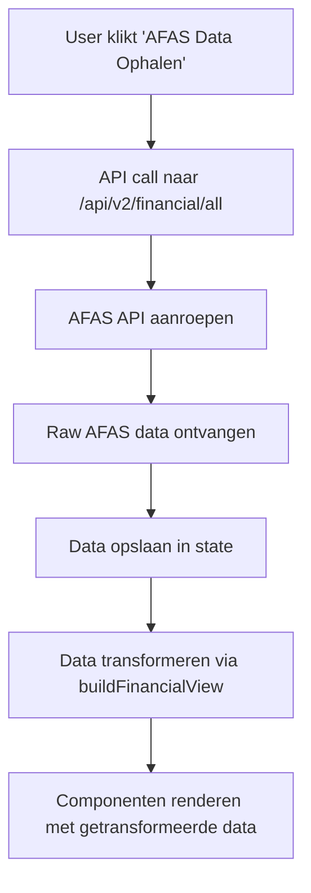

# Financial Controller Agent - Project Architecture

## Overzicht

Dit project is een Next.js applicatie die een financiële controller agent implementeert. Het systeem haalt financiële data op uit AFAS, transformeert deze naar bruikbare formaten, en biedt zowel traditionele financiële rapportages als AI-gedreven analyses.

## Technische Stack

- **Frontend**: Next.js 14 met App Router
- **Styling**: Tailwind CSS
- **AI**: Google Gemini 2.5 Flash
- **Data**: AFAS API (extern)
- **Authentication**: Custom auth systeem
- **Deployment**: Vercel-ready

## Projectstructuur

```
financial-controller-agent/
├── app/                          # Next.js App Router
│   ├── (pages)/                  # Route groups
│   │   ├── (auth)/              # Authentication pages
│   │   │   ├── signin/          # Login pagina
│   │   │   ├── signup/          # Registratie pagina
│   │   │   ├── reset-password/  # Wachtwoord reset
│   │   │   ├── update-password/ # Wachtwoord wijzigen
│   │   │   └── signout/         # Uitloggen
│   │   └── demo/                # Hoofdapplicatie
│   │       ├── page.js          # Main dashboard
│   │       ├── AIChat.jsx       # AI chat component
│   │       ├── ChatFinanceGemini.jsx # Legacy AI chat
│   │       ├── components/      # Financiële componenten
│   │       │   ├── BalanceSheet.jsx
│   │       │   ├── EnhancedProfitLoss.jsx
│   │       │   ├── CashFlowOverview.jsx
│   │       │   ├── CategoryOverview.jsx
│   │       │   ├── ManagementRapportage.jsx
│   │       │   ├── MonthlyOverview.jsx
│   │       │   └── FinancialChecks.jsx
│   │       ├── utils/           # Utility functies
│   │       │   └── formatters.js
│   │       └── old/             # Legacy versie
│   ├── api/                     # API routes
│   │   ├── auth/                # Authentication endpoints
│   │   │   └── post-user-create/
│   │   ├── v1/                  # API versie 1
│   │   │   ├── local/           # Lokale test endpoints
│   │   │   └── test/            # Test endpoints
│   │   └── v2/                  # API versie 2 (huidige)
│   │       ├── ai-chat/         # AI chat endpoint
│   │       ├── chat/            # Legacy chat endpoint
│   │       ├── chat-gemini/     # Gemini chat endpoint
│   │       └── financial/       # Financiële data endpoints
│   │           ├── all/         # Alle financiële data
│   │           └── route.js     # Basis financiële endpoint
│   ├── assets/                  # Statische assets
│   │   └── images/
│   │       └── ficare_logo.svg
│   ├── globals.css              # Global styles
│   ├── layout.js                # Root layout
│   └── page.js                  # Homepage
├── components/                   # Shared components
│   └── v1/
│       └── MonthlyChecks.js
├── docs/                        # Documentatie
├── hooks/                       # Custom React hooks
├── lib/                         # Utility libraries
│   └── finance/
│       ├── tools.js             # AI tools voor Gemini
│       └── transform.js         # Data transformatie
├── middleware.js                # Next.js middleware
├── public/                      # Public assets
└── package.json                 # Dependencies
```

## Data Flow

### 1. Data Ophalen


### 2. Data Transformatie
De `buildFinancialView` functie in `lib/finance/transform.js` transformeert ruwe AFAS data naar gestructureerde formaten:

- **Balans**: Activa/Passiva hiërarchie
- **W&V**: Kosten/Opbrengsten hiërarchie  
- **Categorieën**: Groepering per categorie
- **Maandoverzicht**: Per maand samengevat
- **Transactiedetails**: Gedetailleerde mutaties

### 3. Component Rendering
Elk component gebruikt de getransformeerde data om specifieke views te renderen:

- **BalanceSheet**: Hiërarchische balans met collapse/expand
- **ManagementRapportage**: Winst & Verlies statement
- **CategoryOverview**: Categorie-gebaseerde overzichten
- **CashFlowOverview**: Kasstroom analyse
- **FinancialChecks**: Automatische financiële controles

## State Management

### Hoofdstate (page.js)
```javascript
const [rowsAll, setRowsAll] = useState([]);                    // Alle AFAS data
const [financialView, setFinancialView] = useState(null);      // Getransformeerde data
const [loading, setLoading] = useState(false);                 // Loading state
const [error, setError] = useState(null);                      // Error handling
const [periodFrom, setPeriodFrom] = useState('');              // Periode van
const [periodTo, setPeriodTo] = useState('');                  // Periode tot
const [activeTab, setActiveTab] = useState('ai-chat');         // Actieve hoofdtab
const [activeSubTab, setActiveSubTab] = useState('balance');   // Actieve sub-tab
const [selectedCategory, setSelectedCategory] = useState(null); // Geselecteerde categorie
const [selectedMonth, setSelectedMonth] = useState(null);      // Geselecteerde maand
const [availableAdministrations, setAvailableAdministrations] = useState([]); // Beschikbare admins
const [selectedAdministrations, setSelectedAdministrations] = useState([]);   // Geselecteerde admins
```

### Component State
Elk component heeft zijn eigen lokale state voor:
- Collapse/expand functionaliteit
- Sortering
- Filtering
- UI interacties

## API Endpoints

### `/api/v2/financial/all`
- **Methode**: GET
- **Functie**: Haalt alle financiële data op uit AFAS
- **Response**: JSON met ruwe AFAS mutaties
- **Gebruikt door**: Hoofdpagina voor initiële data load

### `/api/v2/ai-chat`
- **Methode**: POST
- **Functie**: AI chat functionaliteit met Gemini
- **Request Body**: 
  ```javascript
  {
    messages: [],           // Chat geschiedenis
    period_from: string,    // Periode van
    period_to: string,      // Periode tot
    baseUrl: string,        // Base URL voor tools
    currentDate: string,    // Huidige datum
    currentTime: string     // Huidige tijd
  }
  ```
- **Response**: 
  ```javascript
  {
    answer: string,         // AI antwoord
    toolResults: object     // Resultaten van AI tools
  }
  ```

### `/api/v2/chat-gemini`
- **Methode**: POST
- **Functie**: Legacy Gemini chat endpoint
- **Status**: Verouderd, vervangen door `/api/v2/ai-chat`

## UI/UX Design Principes

### 1. Professionaliteit
- Geen emojis in UI
- Strakke, zakelijke styling
- Consistente kleurenschema's
- Goede contrast en toegankelijkheid

### 2. Tech-focused Design
- Moderne, clean interface
- Excel-achtige tabellen
- Sticky headers voor navigatie
- Responsive design

### 3. Progressive Disclosure
- Collapse/expand functionaliteit
- Tab-based navigatie
- Drill-down mogelijkheden
- Hiërarchische data weergave

### 4. Consistent Branding
- Gebaseerd op auth pages styling
- Kleurenschema: `#222c56` (donkerblauw), `#82cff4` (lichtblauw)
- Rounded corners: `rounded-lg`
- Shadows: `shadow-sm`

## Data Hiërarchie

### AFAS Data Structuur
```javascript
{
  "Boekstuknummer": "2024001",
  "Datum": "2024-01-15",
  "Type_rekening": "Activa" | "Passiva" | "Kosten" | "Opbrengsten",
  "Omschrijving_1": "Hoofdcategorie",
  "Omschrijving_2": "Subcategorie",
  "Omschrijving_3": "Detailcategorie",
  "Rekeningnummer": "1000",
  "Debet": 1000.00,
  "Credit": 0.00,
  "Admin._zonder_admin._filter": "1",
  // ... andere velden
}
```

### Getransformeerde Data Structuur
```javascript
{
  balance: {
    activa: [...],
    passiva: [...]
  },
  profitLoss: {
    kosten: [...],
    opbrengsten: [...]
  },
  categories: [...],
  monthly: [...],
  transactions: [...]
}
```

## Financiële Berekeningen

### Balans Berekeningen
- **Activa Totalen**: `debet - credit` per categorie
- **Passiva Totalen**: `debet - credit` per categorie
- **Balans Verschil**: `activa + passiva` (rekening houdend met tekens)
- **Balans Controle**: `|balans_verschil| - |netto_resultaat|`

### W&V Berekeningen
- **Kosten Totalen**: `debet - credit` per categorie
- **Opbrengsten Totalen**: `debet - credit` per categorie
- **Netto Resultaat**: `opbrengsten - |kosten|`

### Speciale Regels
- **Debiteur/Crediteur**: Toon alleen `Omschrijving_3`, geen subcategorieën
- **Collapse State**: Alle categorieën beginnen ingeklapt
- **Klikbare Bedragen**: Alleen op hoofdcategorieën, niet op subcategorieën

## Administratie Filtering

### Extractie
```javascript
const extractAdministrations = (data) => {
  const adminIds = [...new Set(data.map(row => row['Admin._zonder_admin._filter']))];
  return adminIds.filter(id => id && id.trim() !== '');
};
```

### Filtering
```javascript
const filteredData = rowsAll.filter(row => 
  selectedAdministrations.includes(row['Admin._zonder_admin._filter'])
);
```

### UI
- Toggle buttons voor elke administratie
- "Alles" / "Geen" knoppen
- Default: alleen eerste administratie geselecteerd

## Error Handling

### Frontend Errors
- Loading states voor alle async operaties
- Error messages in UI
- Graceful degradation bij API failures
- Validation van user input

### Backend Errors
- Try-catch blocks in alle API routes
- Detailed logging met request IDs
- Proper HTTP status codes
- Error messages in response

## Performance Optimalisaties

### Data Management
- Client-side filtering (geen extra API calls)
- Efficient data transformatie
- Memoization van berekeningen
- Lazy loading van componenten

### UI Performance
- Virtual scrolling voor grote datasets
- Debounced search/filter
- Optimized re-renders
- Efficient state updates

## Security

### Authentication
- Custom auth systeem
- Protected routes
- Session management
- Password hashing

### API Security
- Input validation
- Rate limiting
- CORS configuration
- Environment variables voor secrets

## Deployment

### Vercel Configuration
- Environment variables setup
- Build optimization
- Edge functions support
- Automatic deployments

### Environment Variables
```bash
GOOGLE_API_KEY=your_gemini_api_key
NEXT_PUBLIC_BASE_URL=your_base_url
# ... andere configuratie
```

## Monitoring & Logging

### Frontend Logging
- Console logs voor debugging
- Error tracking
- Performance monitoring
- User interaction tracking

### Backend Logging
- Request ID tracking
- Function call logging
- Error stack traces
- Performance metrics

## Toekomstige Uitbreidingen

### Geplande Features
- Real-time data updates
- Advanced filtering options
- Export functionaliteit
- Mobile app
- Multi-tenant support

### Technische Verbeteringen
- Database integratie
- Caching layer
- WebSocket support
- Advanced AI features

## Troubleshooting

### Veelvoorkomende Problemen
1. **API Timeouts**: Check AFAS connectivity
2. **Data Transformatie Errors**: Validate AFAS response format
3. **AI Chat Issues**: Verify Gemini API key
4. **UI Rendering Problems**: Check component state management

### Debug Tips
- Gebruik browser developer tools
- Check console logs
- Verify API responses
- Test componenten in isolatie
